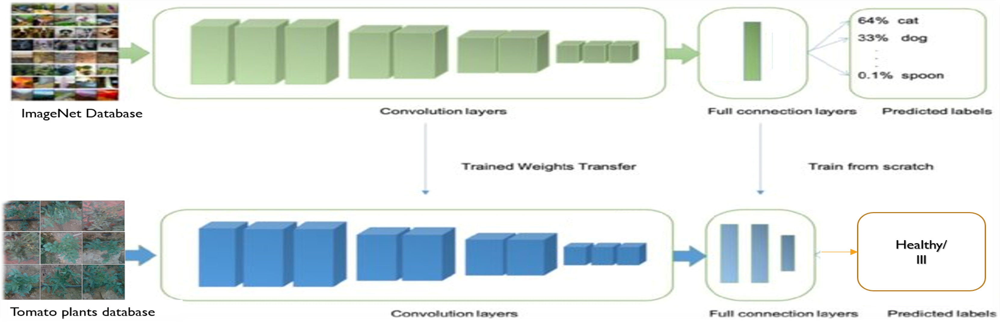
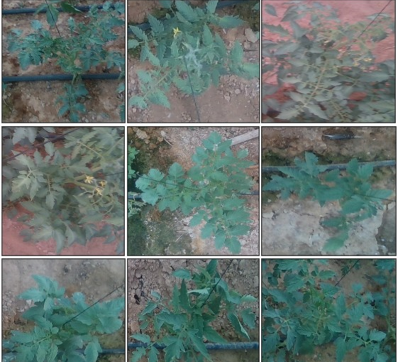
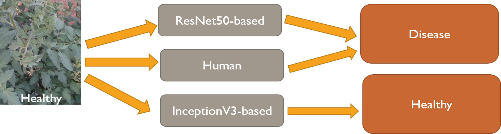
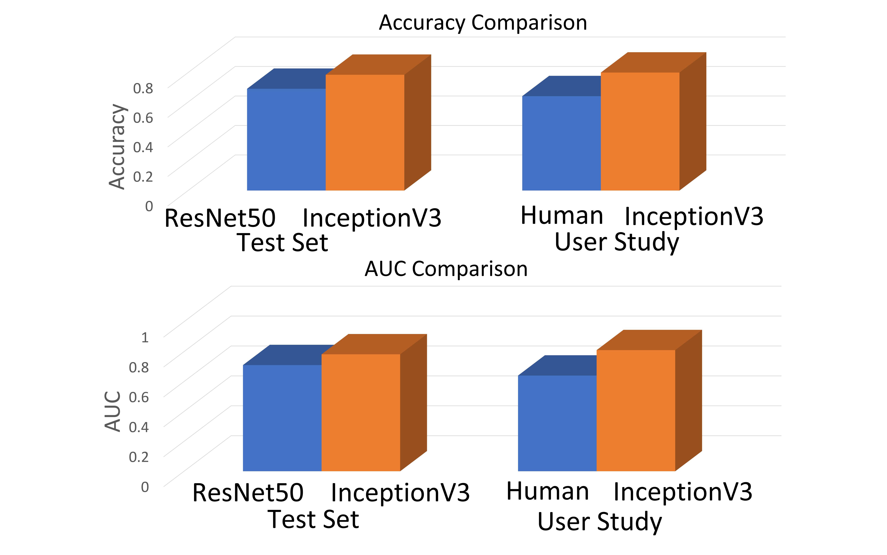
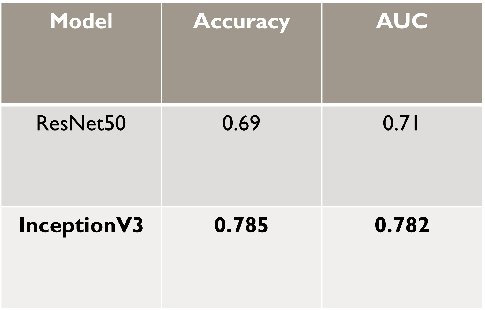

# Research-Methods

This repository includes the final project authored for the "Research Methods" course at Ben-Gurion University of the Negev. The title of this project is **TYLCV Disease Identification in Tomato Plant Images using Transfer Learning and InceptionV3**. The objective was to create a high performance CNN model for recognizing disease in tomato plants.

  
  

In this paper We trained a deep CNN model to identify ill tomato plants using a relatively **small dataset of 1000 images** labeled by experts. To overcome the limited data challenge, we utilize a pre-trained model and transfer its learned knowledge to our task. This method is referred to as **Transfer Learning**. We used a model that is based on an Inception(Szegedy et al. 2016) that was pre-trained on the ImageNet dataset (Deng et al. 2009). The **InceptionV3** model was adapted and fine tuned to our **image classification** task. We compared the performances of our model to ResNet50-based model (He et al. 2016) on the dataset. We also conducted a **user study to establish the human level performance** and to compare it to our model.

**Our model outperformed the other model and the user study results.**

  
  
  

